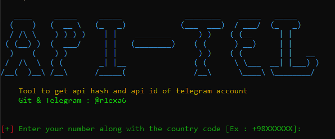

```markdown
# Telegram API Tool 📱🔑

This tool allows you to retrieve the `api_id` and `api_hash` of a Telegram account. 🚀

## Requirements 📋

To run this tool, you need the following Python libraries:

- `requests` 🌐
- `BeautifulSoup4` 🍲
- `colorama` 🌈

You can install them using the following command:

```bash
pip install requests beautifulsoup4 colorama
```

## How to Use 🛠️

1. Clone or download the repository. 📥
2. Run the script using Python. 🖥️

   ```bash
   python apis_tg.py
   ```

3. Enter your phone number with the country code (e.g., `+98XXXXXX`). 📞
4. After entering the number, you will receive a code on your Telegram account. 📲
5. Input the received code in the terminal. 🔐
6. The tool will output your `api_id`, `api_hash`, `Public Key`, and `Production configuration`. 🎉

## Example 🔍:

```
[+] Enter your number along with the country code [Ex : +98XXXXXX]:
```

Once entered, the tool will extract the necessary data and display it as follows:

```
APIs successfully received: ✅

    [+] Api ID: 123456
    [+] Api HASH: abcdef1234567890

    [~] Public Key: public_key_example
    [~] Production configuration: some_configuration_value
```

## Notes ⚠️

- If you receive the message `Your account has been banned! Please try again in 8 hours.`, it means you've attempted too many requests in a short period. Please wait for 8 hours before trying again. ⏳
- Ensure your phone number is valid and formatted correctly. ✅

## Author 📝

- GitHub & Telegram: [@r1exa6](https://t.me/r1exa6) 💬

## License 📄

This project is licensed under the MIT License - see the [LICENSE](LICENSE) file for details.